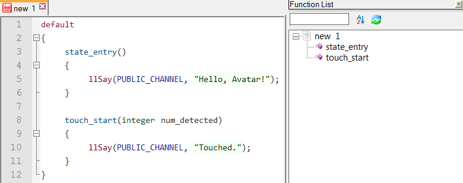

## [Linden Scripting Language](http://wiki.secondlife.com/wiki/LSL_Portal) syntax highlight for [Notepad++](https://www.notepad-plus-plus.org/)

### Readme contents

* [Quick start](#quick-start)
* [Bugs, issues & feature requests](#bugs-issues--feature-requests)
* [Visit the Builder's Brewery](#visit-the-builders-brewery)
* [Syntax](#syntax)
* [Autocompletion](#autocompletion)
* [Snippets via FingerText](#snippets-via-fingertext)
* [Code structure](#code-structure)
* [Code folding](#code-folding)
* [Screenshots and screencast](#screenshots-and-screencast)

### Quick start

* Download:
  * [latest release as *.zip](https://github.com/buildersbrewery/lsl-for-notepadplusplus/archive/master.zip)
  * [latest release as *.tar.gz](https://github.com/buildersbrewery/lsl-for-notepadplusplus/archive/master.tar.gz)
* Clone the repo: `git clone git://github.com/buildersbrewery/lsl-for-notepadplusplus.git`

### Bugs, issues & feature requests

* Please search for [existing issues](https://github.com/buildersbrewery/lsl-for-notepadplusplus/issues/) before opening a [new issue](https://github.com/buildersbrewery/lsl-for-notepadplusplus/issues/new/).

### Visit the Builder's Brewery

* Homepage: [http://www.buildersbrewery.com/](http://www.buildersbrewery.com/)
* In Second Life: [Builders_Brewery/128/154/24/](http://maps.secondlife.com/secondlife/Builders%20Brewery/128/154/24/)
* Calendar with class schedule: [http://www.buildersbrewery.com/calendar/](http://www.buildersbrewery.com/calendar/)

___

### Syntax:

* If `...\Notepad++\userDefineLang.xml` __exists__ where [Notepad++](https://www.notepad-plus-plus.org/) is installed.
  * Copy and paste the code for [LSL](http://wiki.secondlife.com/wiki/LSL_Portal) from [userDefineLang.xml](Notepad++/userDefineLang.xml).
  * When saving changes to the file make sure the file's encoding is `ANSI/ASCII`!
* If `...\Notepad++\userDefineLang.xml` __does not exist__ where [Notepad++](https://www.notepad-plus-plus.org/) is installed.
  * Open [Notepad++](https://www.notepad-plus-plus.org/) and go to `Language > Define your language > Import` to import a temporary copy of [userDefineLang.xml](Notepad++/userDefineLang.xml) which you can delete when done.
  * Make sure the encoding of the file you are importing is `ANSI/ASCII`!
* Choose the language via `Language > LSL` from the menu. You should should be able to find it at the bottom of the language menu in the section for user defined languages.

### Autocompletion:

* Copy and paste [lsl.xml](Notepad++/plugins/APIs/lsl.xml) to `...\Notepad++\plugins\APIs\lsl.xml` where [Notepad++](https://www.notepad-plus-plus.org/) is installed.
* Make sure the file's encoding is `ANSI/ASCII`!
* Goto `Settings > Preferences > Backup&Autocompletion` and make sure you set `enable auto-completion on each input` to `function completion` and you enable `function parameter hints on input`.

### Snippets via FingerText:

Install [FingerText](https://github.com/erinata/FingerText) from the [Notepad++](https://www.notepad-plus-plus.org/) Plugin Manager. Then from the menu go to `Plugins > FingerText > Import Snippets from ftd file` to import the [LSL](http://wiki.secondlife.com/wiki/LSL_Portal) snippets and start working on any file with an `*.lsl`-Extension.

### Code structure:

Add code snippets from [functionList.xml](Notepad++/functionList.xml) to `../Notepad++/functionList.xml` where [Notepad++](https://www.notepad-plus-plus.org/) is installed.

Read more about the [function list in Notepad++](https://www.notepad-plus-plus.org/features/function-list.html) on its homepage.

### Code folding:

Having setup the [EOL](https://en.wikipedia.org/wiki/Newline) incorrectly will mess up the code-folding.

Make sure `Edit >> EOL conversion` is set to `Edit >> EOL conversion >> Windows format`.

### Screenshots and screencast:

